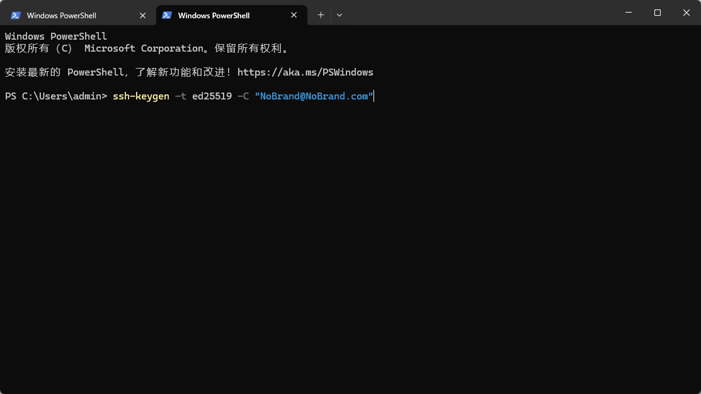
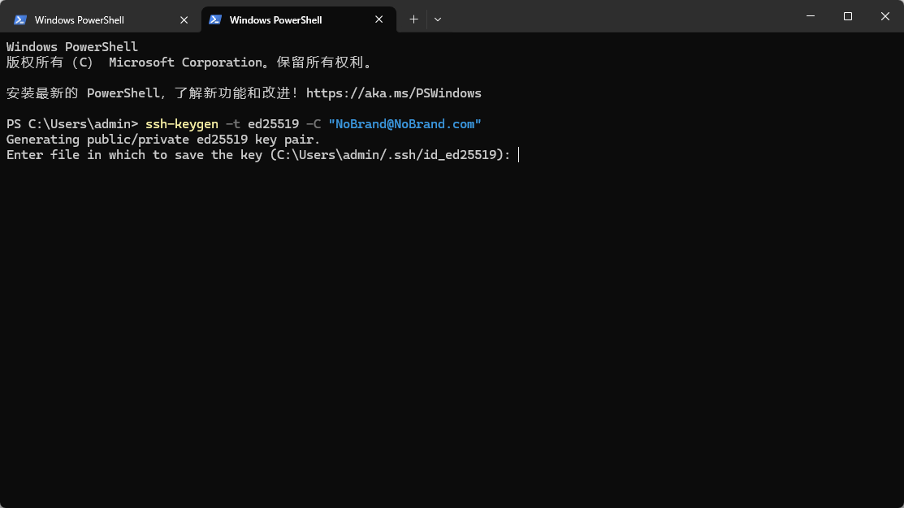
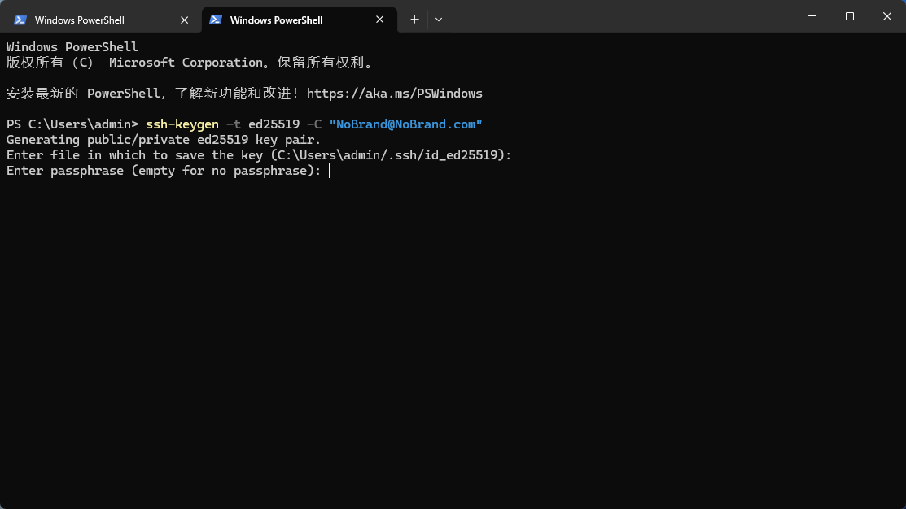
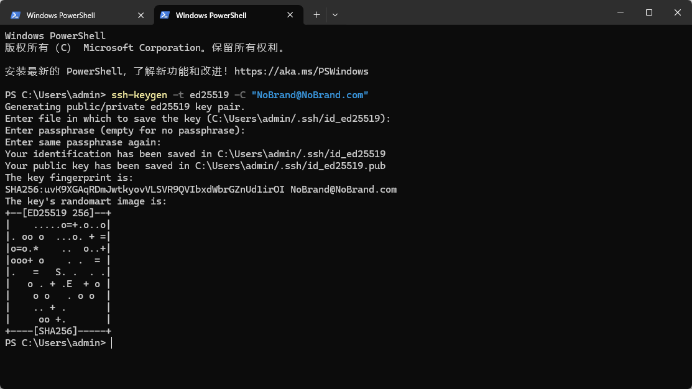
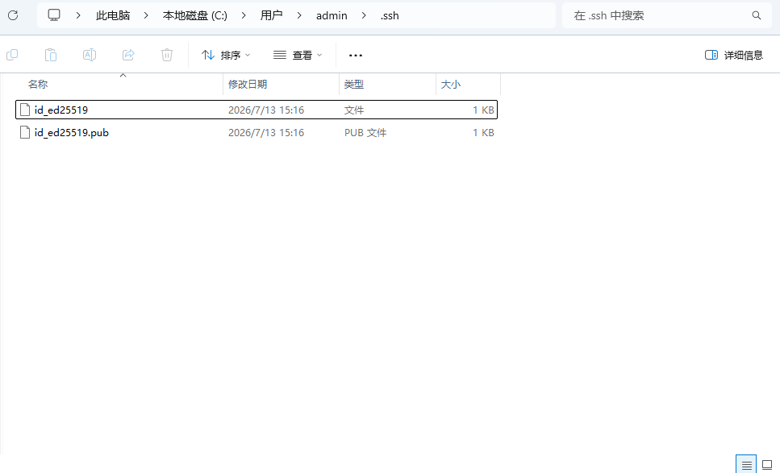
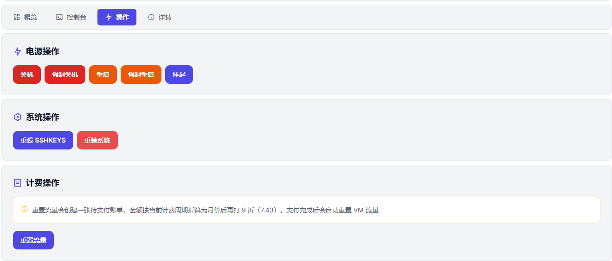
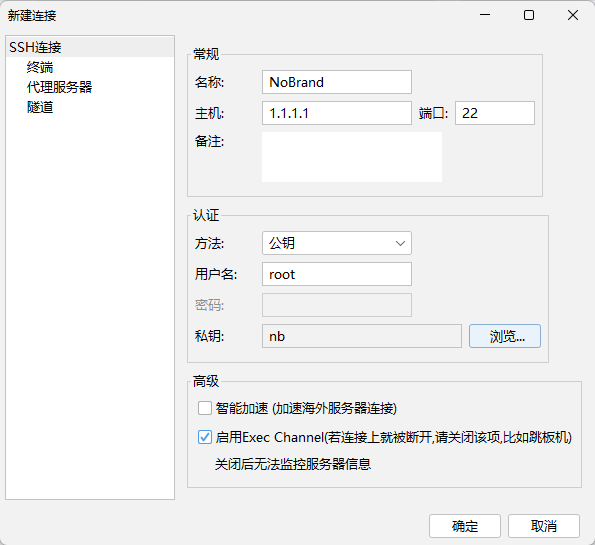

# NoBrand 通过 SSH Key 登录教程

**作者**：ike

购买 NoBrand 服务器时通常会要求提供 SSH 公钥。很多同学为了省事，可能会通过网页在线生成或者直接让 AI 生成，这样往往会导致本地没有保存私钥（或者忽略了私钥），最终无法成功登录 VPS 服务器。因此，特别编写了这篇针对新手的 SSH Key 登录配置教程。

> **⚠️ 安全提示：**
> 极不建议通过第三方网页或 AI 工具生成 SSH 密钥对，这存在极大的密钥泄露风险。密钥对应当始终在本地生成并妥善保管。

---

## 1. 通过本地终端生成 SSH 密钥对

打开本地终端（Terminal）或命令提示符（CMD）。这里以 Windows 的 CMD 为例，其他操作系统（macOS/Linux）的操作完全相同。

输入以下命令生成更为安全高效的 `ed25519` 格式密钥：

```bash
ssh-keygen -t ed25519 -C "your_email@example.com"
```
*(注：双引号中的 email 地址可以随意替换为你自己的标识或邮箱)*



执行命令后，系统会提示你确认密钥的保存路径：



一般情况下直接回车保持默认路径即可。接着，系统会提示是否为私钥设置密码（passphrase）：



你可以根据个人安全需求选择设置，为了演示方便，这里直接回车跳过（不设置密码）：



此时 SSH 密钥对已经成功生成。你可以根据提示的本地路径找到它们：



*   `id_ed25519.pub` 是 **公钥**（用于填入服务器管理面板）。
*   `id_ed25519` 是 **私钥**（保存在本地，用于客户端登录连接）。

*提示：推荐使用 VS Code 等代码编辑器或系统自带的记事本打开公钥文件并复制内容。*

---

## 2. 在 NoBrand 控制面板配置公钥

*   **如果是新购服务器**：在购买下单页面，直接将 `id_ed25519.pub` 公钥文件里的全部内容复制，并填入对应的输入框中即可。
*   **如果已经购买了服务器**：进入服务器的控制面板，选择**重设 SSH KEY**，然后填入刚才生成的公钥。



---

## 3. 使用 SSH 工具本地连接服务器

填入公钥后，就可以通过私钥在本地进行连接了。SSH 客户端工具有很多，这里以常用的 **FinalShell** 为例：

1. 新增 SSH 连接，名称可以随意填写。
2. **主机**：复制 NoBrand 面板详情页提供的外部连接 IP。
3. **端口**：如果是日本的常规 VPS，默认是 `22` 端口；如果是沪日 IPLC 等线路，由于 NAT 转发的原因，会单独分配一个 SSH 端口，请填写面板上对应分配的外网端口。
4. **认证方式**：选择 **公钥**。
5. **用户名**：填写 `root`。
6. **私钥**：点击“浏览”，根据第 1 步中生成的路径，选择不带 `.pub` 后缀的 **私钥文件** (`id_ed25519`)。如果你之前移动了文件，请选择移动后的新路径。



---

## 总结与建议

配置完成并成功登录后，你就可以自由地使用服务器了。

> **💡 进阶建议：**
> 登录成功后，**极不建议**为了方便而将服务器改回密码登录。开启密码登录非常容易遭到网络上的自动化脚本扫段和暴力破解，保持纯密钥登录是保障服务器安全的基础。
